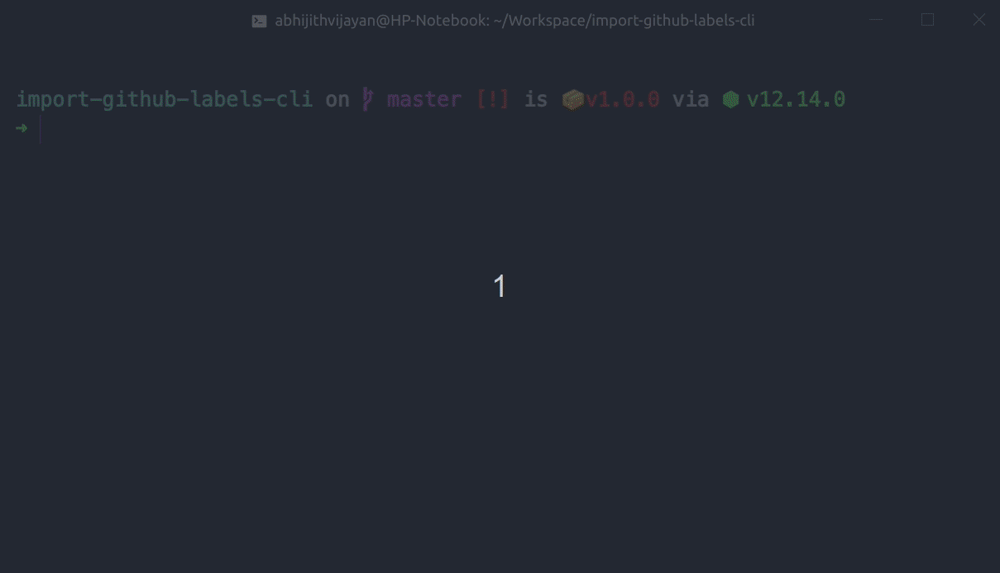

<h1 align="center">import-github-labels-cli</h1>
<p align="center">CLI to sync labels between repositories on GitHub</p>
<div align="center">
  <a href="https://www.npmjs.com/package/import-github-labels">
    
  </a>
  <a href="https://travis-ci.com/github/abhijithvijayan/import-github-labels-cli">
    
  </a>
  </a>
  <a href="https://github.com/benawad/destiny">
    
  </a>
  <a href="https://github.com/abhijithvijayan/import-github-labels-cli/blob/master/license">
    
  </a>
  <a href="https://twitter.com/intent/tweet?text=Check%20out%20import-github-labels%21%20by%20%40_abhijithv%0A%0AMy%20awesome%20command-line%20tool%0Ahttps%3A%2F%2Fgithub.com%2Fabhijithvijayan%2Fimport-github-labels%0A%0A%23node%20%23javascript%20%23typescript%20%23cli%20%23npm">
     
  </a>
</div>
<h3 align="center">🙋‍♂️ Made by <a href="https://twitter.com/_abhijithv">@abhijithvijayan</a></h3>
<p align="center">
  Donate:
  <a href="https://www.paypal.me/iamabhijithvijayan" target='_blank'><i><b>PayPal</b></i></a>,
  <a href="https://www.patreon.com/abhijithvijayan" target='_blank'><i><b>Patreon</b></i></a>
</p>
<p align="center">
  <a href='https://www.buymeacoffee.com/abhijithvijayan' target='_blank'>
    
  </a>
</p>
<hr />

❤️ it? ⭐️ it on [GitHub](https://github.com/abhijithvijayan/import-github-labels/stargazers)



## Table of Contents

- [Installation](#installation)
- [Usage](#usage)
- [FAQ](#faq)
  - [Generate new token](#generate-new-token)
  - [Why do I need a token](#why-do-I-need-a-token)
- [Issues](#issues)
  - [🐛 Bugs](#-bugs)
- [LICENSE](#license)

## Installation

Ensure you have [Node.js](https://nodejs.org) 10 or later installed. Then run the following:

```
npm install --global import-github-labels
```

If you don't want to install the CLI globally, you can use `npx` to run the CLI:

```
npx import-github-labels --help
```

## Usage

```
$ import-github-labels --help

  Create GitHub repo from Command-line

  Usage
    $ import-github-labels [input] [options]

  Input
    sync            Import GitHub labels from a repo to another
  
  Options
    -v, --version   Show the version and exit with code 0

  Examples
    $ import-github-labels sync
```

## FAQ

### Generate new token

Go to [Personal access tokens](https://github.com/settings/tokens)

### Why do I need a token

- For unauthenticated requests, the rate limit is 60 requests per
  hour.
  See [Rate Limiting](https://developer.github.com/v3/#rate-limiting)
- The token must be passed together when asked

## Issues

_Looking to contribute? Look for the [Good First Issue](https://github.com/abhijithvijayan/import-github-labels/issues?q=is%3Aissue+is%3Aopen+sort%3Aupdated-desc+label%3A%22good+first+issue%22)
label._

### 🐛 Bugs

Please file an issue [here](https://github.com/abhijithvijayan/import-github-labels/issues/new) for bugs, missing documentation, or unexpected behavior.

[**See Bugs**](https://github.com/abhijithvijayan/import-github-labels/issues?q=is%3Aissue+is%3Aopen+sort%3Aupdated-desc+label%3A%22type%3A+bug%22)

## License

MIT © [Abhijith Vijayan](https://abhijithvijayan.in)
